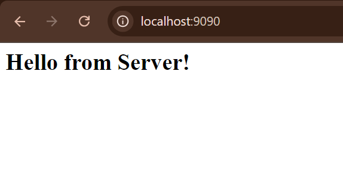
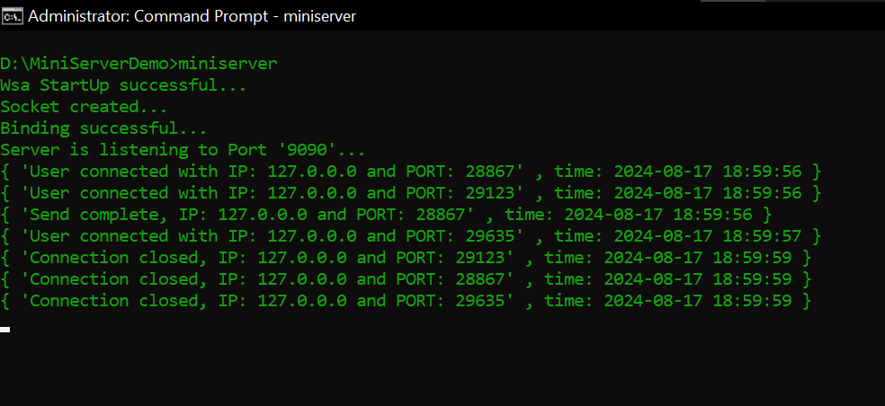

## How to use Mini Server as a library

Clone the repo and create a file `<your-program-name>.cpp` anywhere in your project serving as an Entri-point for the server

Include the MiniServer header file

```cpp
#include "miniserver.hpp"
```

In the main, Create an instance of the HttpServer and listen on a port after all your route defintions

```cpp
int main(){
    HttpServer app;

    // define routes here

    app.listen(9090);
    return 0;
}
```

Sample program

```cpp
#include "miniserver.hpp"

int main()
{
    HttpServer app;

    app.routeGet["/"] = [](Request &req, Response &res) -> int
    {
        res.setContentType("text/html");
        res.send("<h1>Hello from Server!<h1>");
        return 0;
    };

    app.listen(9090);
    return 0;
}
```

Now, to compile the program you must do these steps (You can use Make build tool to build the project easily)

1. Specify the Library include path `-IMiniServer/include`
2. Link the `libminiserver.dll` file using `-lminiserver`
3. Specify the library search path `-LMiniServer/lib`

Here's all the three steps in one command

```cmd
g++ -o miniserver <your-program-name>.cpp -IMiniServer/include -LMiniServer/lib -lminiserver
```

If the compilation is successfull you can execute the program

```cmd
miniserver
```

And done!, Now your server is listening to the port 9090 go to your browser or any tool and search `localhost:9090`



You can view the connection made by the clients through the logs


